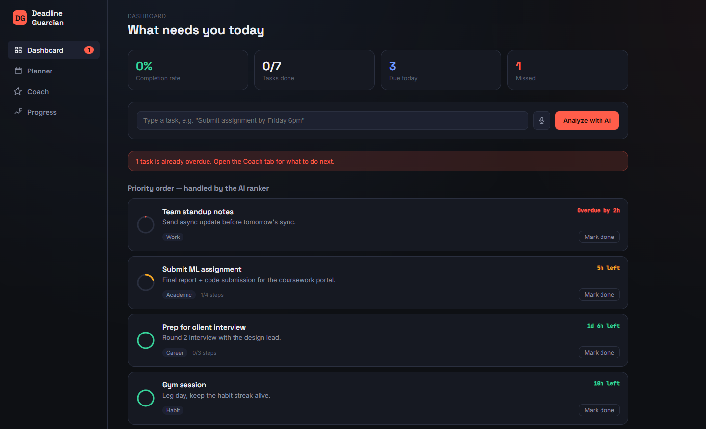
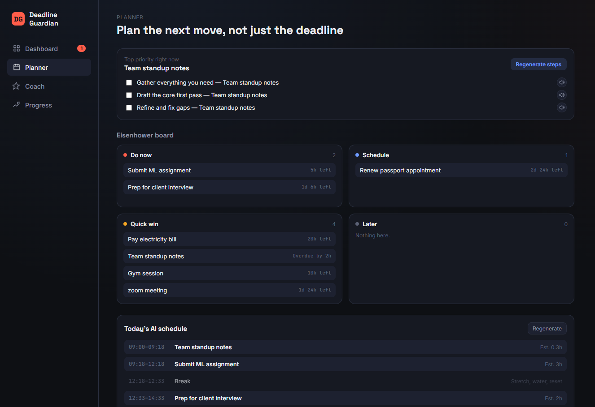
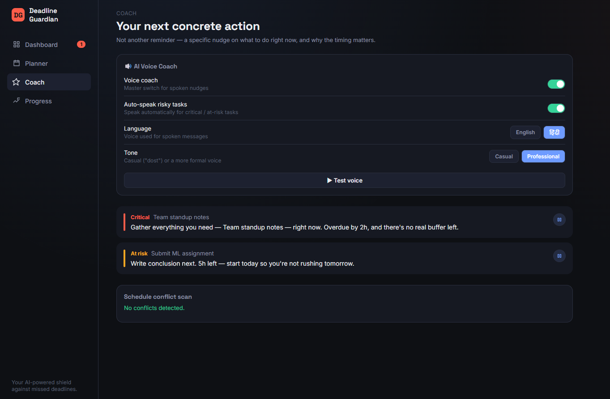
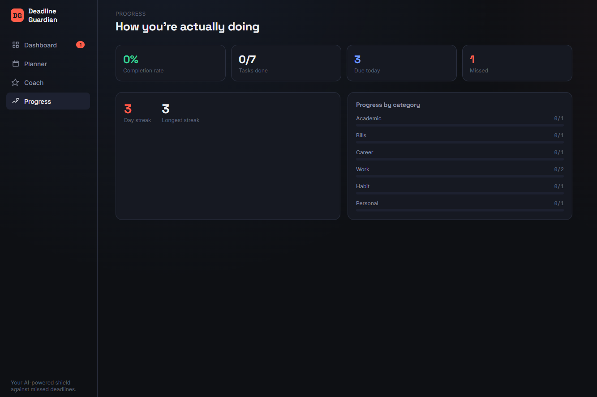

# Deadline Guardian AI

> 🚀 **The Last-Minute Life Saver**

An AI-powered productivity companion that goes beyond passive reminders by helping users prioritize, plan, schedule, and complete tasks before deadlines are missed.

Built using **React**, **Vite**, and **Google Gemini AI** for the **Google AI Studio × BlockseBlock Hackathon 2026**.

---

## 🌐 Live Demo

https://deadline-guardian-ai-193092414626.us-central1.run.app

---

## 📂 GitHub Repository

https://github.com/hassan2193/deadline-guardian-ai

---

# 📸 Screenshots

## Dashboard



---

## AI Planner



---

## AI Coach



---

## Progress Dashboard



---

# 🚀 Problem Statement

The Last-Minute Life Saver

Build an AI-powered solution that goes beyond passive reminders and actively helps users complete important tasks before deadlines are missed.

---

# 💡 Solution Overview

Deadline Guardian AI transforms passive reminders into intelligent execution guidance.

Instead of simply notifying users about deadlines, it analyzes tasks, prioritizes work, generates schedules, detects risks, and provides personalized AI coaching to help users complete work on time.

Example:

Traditional Reminder

> Assignment due tomorrow.

Deadline Guardian AI

> You have 5 hours remaining. Start the research section now. Estimated completion time: 45 minutes.

---

# ✨ Key Features

## 🤖 AI Task Analysis

- Task understanding using Gemini
- Priority estimation
- Category prediction
- Effort estimation

---

## 📊 Intelligent Prioritization

- Dynamic AI ranking
- Eisenhower Matrix
- Deadline-aware ordering

---

## 🧩 Autonomous Task Breakdown

- AI-generated subtasks
- Execution-ready workflow
- Estimated completion times

---

## 📅 AI Daily Schedule

- Time-blocked planning
- Break scheduling
- Workload optimization

---

## 🎯 AI Productivity Coach

- Personalized productivity guidance
- Professional & Casual coaching modes
- Context-aware recommendations

---

## 🔊 AI Voice Coach

- English & Hindi support
- Automatic voice alerts
- Manual playback
- Speech Synthesis API

---

## ⚠️ Risk Detection

- Deadline collision detection
- Scheduling conflict analysis
- Workload balancing

---

## 📈 Progress Tracking

- Completion analytics
- Productivity streaks
- Performance insights

---

## 🎤 Voice Task Input

- Hands-free task creation
- Web Speech API

---

## 💾 Offline-First

- Local Storage persistence
- AI fallback logic
- Works without network

---

# 🛠 Technology Stack

### Frontend

- React.js
- Vite
- React Router

### State Management

- React Context API
- Custom Hooks

### AI

- Google Gemini API
- Google AI Studio
- Prompt Engineering

### Browser APIs

- Web Speech API
- Speech Synthesis API

### Storage

- Browser Local Storage

### Development

- JavaScript
- HTML5
- CSS3

---

# ☁ Google Technologies Utilized

- Google AI Studio
- Gemini API
- Gemini-assisted branding assets

---

# 🏗 Architecture

```text
Frontend (React + Vite)
        ↓
React Context API
        ↓
AI Service Layer
        ↓
Gemini API
        ↓
Fallback Heuristic Engine
        ↓
Browser Local Storage
```

---

# 🚀 Getting Started

```bash
git clone https://github.com/hassan2193/deadline-guardian-ai

cd deadline-guardian-ai

npm install

npm run dev
```

Create a `.env` file

```env
VITE_GEMINI_API_KEY=YOUR_GEMINI_API_KEY
```

---

# 💡 Innovation Highlights

- AI-first productivity assistant
- Action-oriented guidance
- AI Voice Coach
- Professional & Casual coaching
- Offline AI fallback
- Voice task creation
- Intelligent scheduling

---

# 📈 Impact

Deadline Guardian AI helps users

- Reduce missed deadlines
- Improve productivity
- Build consistent work habits
- Receive contextual AI guidance
- Complete work more effectively

---

# 🔮 Future Scope

- Google Calendar Integration
- Gmail Task Extraction
- Firebase Authentication
- Team Collaboration
- Mobile App
- Cross-device Sync

---

# 👨‍💻 Developed For

**Google AI Studio × BlockseBlock Hackathon 2026**

**Problem Statement:** The Last-Minute Life Saver
